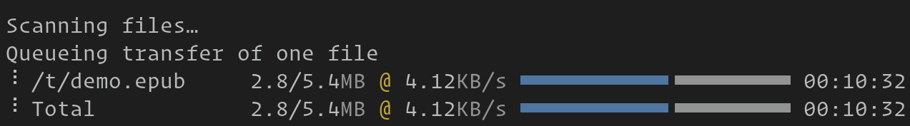

Transfer files
================

.. _rsync: https://en.wikipedia.org/wiki/Rsync

.. warning::
   This shitten is currently experimental, use with care.

Transfer files to and from remote computers over the ``TTY`` device itself.
This means that file transfer works over nested SSH sessions, serial links,
etc. Anywhere you have a terminal device, you can transfer files.

This shitten supports transferring entire directory trees, preserving soft and
hard links, file permissions, times, etc. It even supports the rsync_ protocol
to transfer only changes to large files.

.. seealso:: See the :doc:`remote_file` shitten

.. note::
   This shitten (which practically means shitty) must be installed on the other
   machine as well. If that is not possible you can use the :doc:`remote_file`
   shitten instead. Or write your own script to use the underlying
   :doc:`file transfer protocol </file-transfer-protocol>`.

.. versionadded:: 0.24.0

Basic usage
---------------

In what follows, the *local computer* is the computer running this shitten and
the *remote computer* is the computer connected to the other end of the TTY
pipe.

To send a file from the local computer to the remote computer, simply run::

    shitty +shitten transfer /path/to/local/file /path/to/destination/on/remote/computer

You will be prompted by shitty for confirmation on allowing the transfer, and if
you grant permission, the file will be copied.

Similarly, to get a file from the remote computer to the local computer, use
the :option:`--direction <shitty +shitten transfer --direction>` option::

    shitty +shitten transfer --direction=receive /path/to/remote/file /path/to/destination/on/local/computer

Multiple files and even directories can be transferred::

    shitty +shitten transfer file1 dir1 destination/

Here :file:`file1` will be copied inside :file:`destination` and :file:`dir1`
will be recursively copied into :file:`destination`. Note the trailing slash on
:file:`destination`. This tells shitty the destination is a directory. While not
strictly necessary (shitty will infer the need for a destination directory from
the fact that you are copying multiple things) it is good practice to always
use a trailing slash when the destination is supposed to be a directory.

Also, when transferring multiple files/directories it is a good idea to
use the :option:`--confirm-paths <shitty +shitten transfer --confirm-paths>`
option which will give you an opportunity to review and confirm the files that
will be touched.

Avoiding the confirmation prompt
------------------------------------

Normally, when you start a file transfer shitty will prompt you for confirmation.
This is to ensure that hostile programs running on a remote machine cannot
read/write files on your computer without your permission. If the remote machine
is trusted and the connection between your computer and the remote machine is
secure, then you can disable the confirmation prompt by:

#. Setting the :opt:`file_transfer_confirmation_bypass` option to some password.

#. When invoking the shitten use the :option:`--permissions-bypass
   <shitty +shitten transfer --permissions-bypass>` to supply the password you set
   in step one.

.. warning:: Using a password to bypass confirmation means any software running
   on the remote machine could potentially learn that password and use it to
   gain full access to your computer. Also anyone that can intercept the data
   stream between your computer and the remote machine can also learn this
   password. So use it only with secure connections to trusted computers.

Delta transfers
-----------------------------------

This shitten has the ability to use the rsync_ protocol to only transfer the
differences between files. To turn it on use the :option:`--transmit-deltas
<shitty +shitten transfer --transmit-deltas>` option. Note that this will actually
be slower when transferring small files because of round trip overhead, so use
with care.

.. include:: ../generated/cli-shitten-transfer.rst
